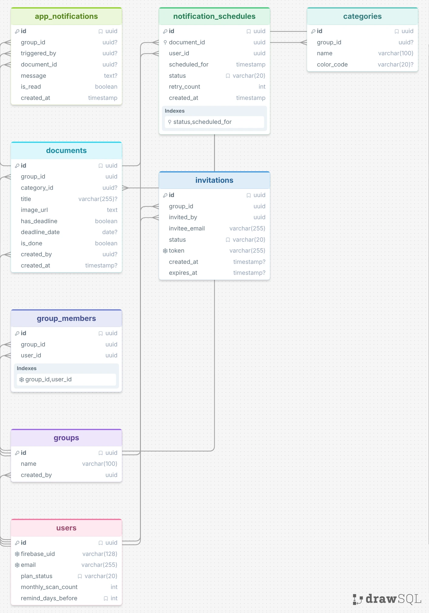

# DB 設計

## 1. 設計方針

- **採用 DBMS**: PostgreSQL
- **命名規則**: 
  - テーブル名：複数形（例：`users`, `documents`）
  - カラム名：`snake_case`（例：`firebase_uid`, `notification_schedules`）
- **物理削除 / 論理削除の方針**: 
  - 原則として**物理削除**とする。
  - ただし、非同期通知管理である `notification_schedules` については、要件定義に基づき物理削除ではなく `status` を `'cancelled'`（キャンセル）に変更することで論理的な状態管理を行う。
- **マイグレーション運用方針**: 
  - **Alembic** を使用してバックエンド（FastAPI / SQLAlchemy）と同期的にスキーマ変更履歴をコード管理する。

## 2. ER 図

> 
> 
> ※リレーションシップ概要：
> - `users` と `groups` は `group_users` を介した多対多の関係（ただし、ユーザー登録時に個人グループが自動生成され1対1のような構造からスタートする仕様をサポート）。
> - `groups` と `documents` は 1対多 の関係。
> - `documents` と `notification_schedules` は 1対多 の関係。

## 3. テーブル定義

### users
Firebase Auth連携に伴い、通常のパスワードカラムは廃止し、認証基盤が発行する一意の識別子（`firebase_uid`）を格納します。また、全員にメールアドレス登録を必須化する要件に対応します。

| カラム名 | 型 | NULL | デフォルト | 説明 |
| :--- | :--- | :--- | :--- | :--- |
| id | bigint | NO | (シリアル) | 主キー |
| firebase_uid | varchar(128) | NO | | Firebase Authが発行する一意のUID（認証連携用） |
| email | varchar(255) | NO | | ユーザーのメールアドレス（必須要件対応） |
| created_at | timestamp | NO | now() | 作成日時 |
| updated_at | timestamp | NO | now() | 更新日時 |

### groups
共有および個人用のワークスペースを定義します（登録時に個人グループが自動生成されるロジックに対応）。

| カラム名 | 型 | NULL | デフォルト | 説明 |
| :--- | :--- | :--- | :--- | :--- |
| id | bigint | NO | (シリアル) | 主キー |
| name | varchar(100) | NO | | グループ名（個人用の場合はユーザー名等） |
| created_at | timestamp | NO | now() | 作成日時 |
| updated_at | timestamp | NO | now() | 更新日時 |

### group_users
ユーザーとグループを紐付ける中間テーブルです（権限平等化に基づき、ロール属性はシンプル化、または将来の拡張要素とします）。

| カラム名 | 型 | NULL | デフォルト | 説明 |
| :--- | :--- | :--- | :--- | :--- |
| id | bigint | NO | (シリアル) | 主キー |
| group_id | bigint | NO | | 外部キー（`groups.id` への参照） |
| user_id | bigint | NO | | 外部キー（`users.id` への参照） |
| created_at | timestamp | NO | now() | 参加日時 |

### documents
OpenAIマルチモーダル解析によって抽出された書類（プリント）データとカレンダー同期用のメタデータを管理します。「済スタンプ」の状態もここで保持します。

| カラム名 | 型 | NULL | デフォルト | 説明 |
| :--- | :--- | :--- | :--- | :--- |
| id | bigint | NO | (シリアル) | 主キー |
| group_id | bigint | NO | | 外部キー（`groups.id` への参照、登録即時カレンダー反映用） |
| title | varchar(255) | NO | | 書類タイトル |
| deadline_date | date | YES | | 提出・イベント期限日（解析結果） |
| image_url | text | NO | | Cloudinary等に保存された書類の安全な画像URL |
| is_completed | boolean | NO | false | 「済スタンプ」フラグ（trueでリマインドキャンセル連動） |
| category | varchar(50) | YES | | 書類カテゴリ（シードデータより割当） |
| created_at | timestamp | NO | now() | 登録日時（アプリ内即時通知のトリガー用） |
| updated_at | timestamp | NO | now() | 更新日時 |

### notification_schedules
期限日の「3日前メール自動リマインド」の送信予定や、Celery Workerによる「指数バックオフ（最大3回リトライ）」、スタンプ連携によるステータス変更を追跡するトランザクションテーブルです。

| カラム名 | 型 | NULL | デフォルト | 説明 |
| :--- | :--- | :--- | :--- | :--- |
| id | bigint | NO | (シリアル) | 主キー |
| document_id | bigint | NO | | 外部キー（`documents.id` への参照） |
| scheduled_date| date | NO | | リマインドメール送信予定日（期限の3日前など） |
| status | varchar(20) | NO | 'pending' | 状態（`pending`, `sent`, `failed`, `cancelled`） |
| retry_count | integer | NO | 0 | 外部API失敗時の自動リトライカウンタ（最大3回） |
| created_at | timestamp | NO | now() | スケジュールレコード作成日時（v7.1要件追記分） |
| updated_at | timestamp | NO | now() | 更新日時 |

## 4. インデックス・制約

- **`users` テーブル**:
  - `UNIQUE (firebase_uid)` : Firebase認証トークンから高速かつ安全にユーザーを特定するための必須インデックス。
  - `UNIQUE (email)` : 同一メールでの重複登録を防止。
- **`group_users` テーブル**:
  - `UNIQUE (group_id, user_id)` : 同一ユーザーが同じグループに二重登録されるのを防止（複合ユニーク制約）。
- **`notification_schedules` テーブル**:
  - `INDEX (status, scheduled_date)` : Celery Beatが「本日送信すべき未送信タスク（`pending`）」を毎日定時バッチで一括検索するための複合インデックス。
  - `INDEX (document_id)` : 書類詳細画面で「済スタンプ」が押された際、該当するドキュメントの未送信リマインドを高速に特定して `status = 'cancelled'` へ一括アップデートするための外部キーインデックス。

## 5. データ保持・整合性ルール

- **「済スタンプ」とリマインドの整合性**:
  - `documents.is_completed` が `true`（済スタンプON）に更新された場合、バックエンドのトリガーまたは非同期タスク（Celery）を介して、関連する `notification_schedules` のうち `status = 'pending'` であるレコードをすべて `status = 'cancelled'` に変更する。
- **カレンダー・アプリ内お知らせのリアルタイム性**:
  - グループ内の誰かが書類を登録（`documents`にインサート）した時点で、Next.js側およびカレンダーコンポーネント（FullCalendar）が参照するAPIが最新データを返すよう設計する。
- **外部APIリトライ限界時のポリシー**:
  - SendGrid等の外部通信失敗時、指数バックオフを伴うリトライが3回に達した（`retry_count = 3`）スケジュールは、システム側で自動的に `status = 'failed'` へ確定させ、エラーログ（ログレベルに応じた出力）を吐き出しタスクを終了する。